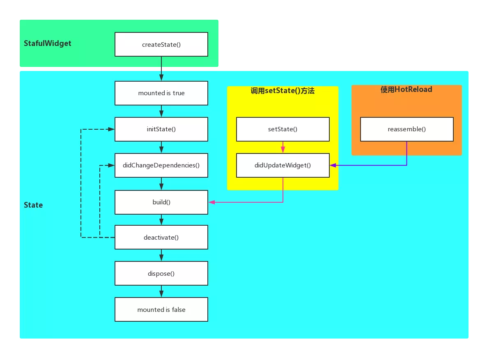

## Getting Started

[Flutter SDK](https://api.flutter.dev/)

## Widget

- Accessibility
- Animation and Motion
- Assets, Images, and Icons
- Async
- Basics
- Cupertino (iOS-style widgets)
- Input
- Interaction Models
- Layout
- Material Components
- Painting and effects
- Scrolling
- Styling
- Text

## StatefulWidget lifecycle

- StatefulWidget
    - createState
- State
    - mounted is true
      - mounted 为 true 的时候才能使用setState() ??? 设置为false也可以用
    - initState
    - didChangeDependencies
      - Called when a dependency of this element changes.
    - build
    - deactivate
    - dispose
    - mounted is false

    - didUpdateWidget
      - check the runtimeType and Widget.key

## StatelessWidget lifecycle

- build

## MaterialApp

MaterialApp 表示当前应用的风格是 Material Design。为了使用其他已经封装好的 Material Design 风格的 Widget，就必须使用 MaterialApp。因此 MaterialApp 经常是 Flutter Widget 树里的第一个元素，就是 Root Widget。

- title
  - 这个 title 是出现在 Android 的任务管理器上或者是 iOS 程序切换管理器中
- color
- theme
  - ThemeData 类型，比如颜色，字体
- home
  - widget 类型，进入程序后展示的第一个页面

## Scaffold

Scaffold 实现了 Material Design 的基本布局结构，例如 AppBar、Drawer、SnackBar 等，所以为了使用这些布局，也必须要使用 Scaffold，所以一个 Flutter App 的 基本结构就是：Root Widget 是 MaterialApp ，然后 MaterialApp 的 子Widget 就是 Scaffold，然后我们在 Scaffolfd 的 子Widget 里写UI。

> 实现`Material Design`基本视觉不觉结构的widget，它被设计为Material App的顶级容器，会自动填满屏幕，适配刘海屏。

- appBar
  - 顶部的标题栏，不设置的话就不会显示。
- backgroundColor
  - Color类型
- body
  - Widget类型

